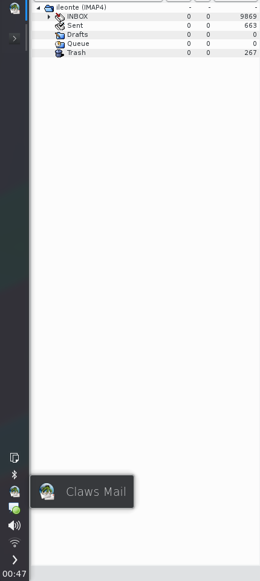

**Prerequisites**
* on Gentoo:
 * `dev-libs/libappindicator`
 * `mail-client/claws-mail`
* on Ubuntu:
 * `libappindicatordev`
 * `libclaws-mail-dev`

**Build instructions**
* clone the repository
* run `make` inside the `claws-mail-indicator` directory
* create a link to `build/lib/indicator.so` inside your Claws Mail plugin directory:
 * `/usr/lib/x86_64/claws-mail/plugins` on Gentoo
 * `/usr/lib/x86_64-linux-gnu/claws-mail/plugins` on Ubuntu
* load the plugin in Claws Mail

**Screenshots**

